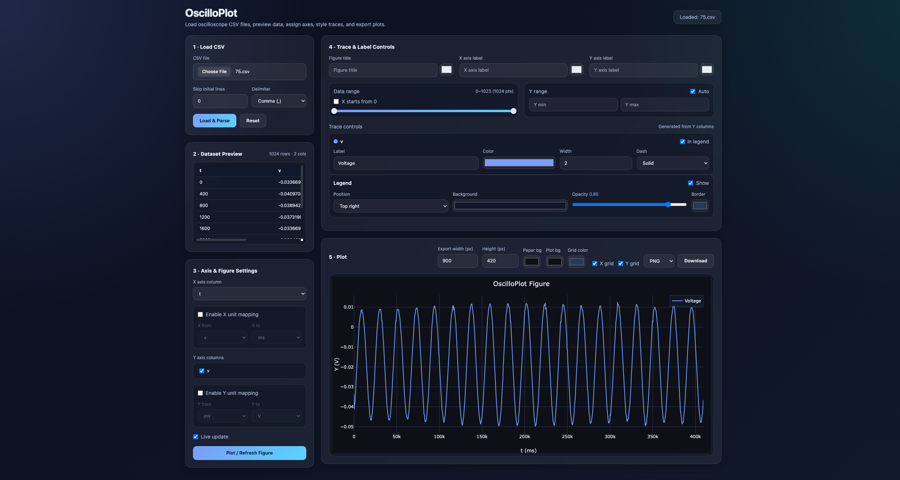

# OscilloPlot

I got tired of using Python every time I needed to plot oscilloscope CSV data. Even for a quick look at a signal, the workflow usually meant opening an old script, fixing the delimiter, skipping metadata lines, selecting columns, adjusting labels, and exporting again. It works, but it’s repetitive and annoying.

So I made this. OscilloPlot lets you load a CSV file from an oscilloscope, quickly preview the data, choose X and Y columns, adjust units and ranges, customize traces, and export the figure — all directly in the browser.

## Live Demo

**Live Demo:** [Open OscilloPlot](https://abulalarabi.com/oscilloplot)

## Features

- Load oscilloscope CSV files directly in the browser
- Skip initial metadata lines before parsing
- Support for multiple delimiters, including auto-detect
- Preview parsed dataset in a compact table
- Select X-axis and one or more Y-axis variables
- Optional X and Y unit mapping
  - X: `s`, `ms`, `us`
  - Y: `V`, `mV`, `uV`
- Select plotting range using an interactive slider
- Optional X-offset removal so the selected range starts at zero
- Manual or automatic Y-axis range selection
- Per-trace customization
  - legend label
  - color
  - line width
  - dash style
  - show or hide in legend
- Figure customization
  - title
  - axis labels
  - label colors
  - legend position and style
  - plot and paper background colors
  - grid color
  - X/Y grid toggles
- Adjustable export size
- Export figure as:
  - PNG
  - JPG
  - SVG
- Fully client-side, no backend required

## Why OscilloPlot

When working with oscilloscope data, a simple plot often requires too many manual steps:
- cleaning exported CSV files
- removing metadata lines
- selecting columns
- adjusting units
- styling traces
- exporting publication-ready plots

OscilloPlot was made to keep all of that in one lightweight interface.

## How It Works

1. Load a CSV file exported from an oscilloscope
2. Optionally skip initial metadata lines
3. Preview the parsed dataset
4. Choose the X-axis column
5. Select one or more Y-axis columns
6. Optionally map X and Y units
7. Adjust the plotting range
8. Customize traces, labels, legend, colors, and background
9. Export the final figure

## Built With

- **HTML**
- **JavaScript**
- **Tailwind CSS**
- **Plotly.js**
- **PapaParse**
- **noUiSlider**

## Usage

### Run locally

Since this is a pure front-end tool, you can run it directly by opening the HTML file in a local server or browser.

### Recommended

For best compatibility, use a modern browser such as:

* Chrome
* Edge
* Firefox

## Open Source

This project is open source and intended to be useful for students, researchers, engineers, and makers who frequently work with oscilloscope data.

## Contributing

Contributions are welcome.

You can contribute by:

* improving the UI
* adding support for more file formats
* improving parsing robustness
* adding advanced oscilloscope-style measurement tools
* improving export and annotation features

To contribute:

1. Fork the repository
2. Create a new branch
3. Make your changes
4. Submit a pull request

## Future Ideas

Possible future additions include:

* automatic detection of common time/voltage columns
* multiple Y-axes
* measurement cursors
* peak-to-peak and frequency estimation
* trace smoothing or filtering
* dark/light theme switching
* saving and loading plot configurations

## License

**MIT License**

## Author

**Abul Al Arabi**

If you use OscilloPlot in your work, a star on the repository would be appreciated.

